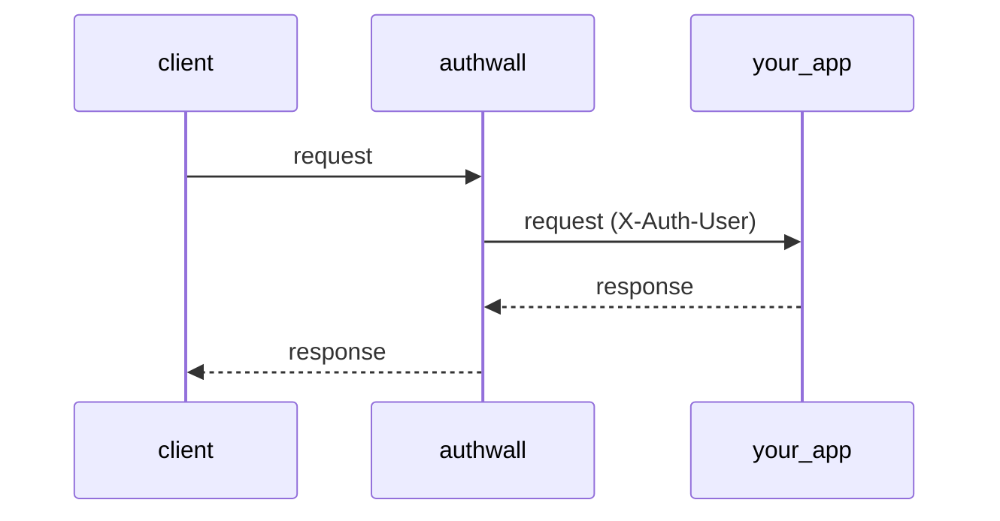

<p>
<a target="_blank" href="https://hub.docker.com/r/vbarbarosh/authwall"></a>
<a target="_blank" href="https://hub.docker.com/r/vbarbarosh/authwall"></a>
<a target="_blank" href="https://github.com/vbarbarosh/authwall"></a>
<a target="_blank" href="https://github.com/vbarbarosh/authwall"></a>
<br>
<a target="_blank" href="https://github.com/vbarbarosh/authwall/actions"></a>
<a target="_blank" href="https://opensource.org/licenses/MIT" rel="nofollow"></a>
</p>

<p align="center"></p>

**Authwall** is an authentication proxy — it sits between clients and an internal app, handling sign-in (email/password, magic links, Google OAuth, GitHub OAuth) and forwarding authenticated   
requests with an X-Auth-User header.

```
client
    ↓
authwall
    ↓
your app
```


