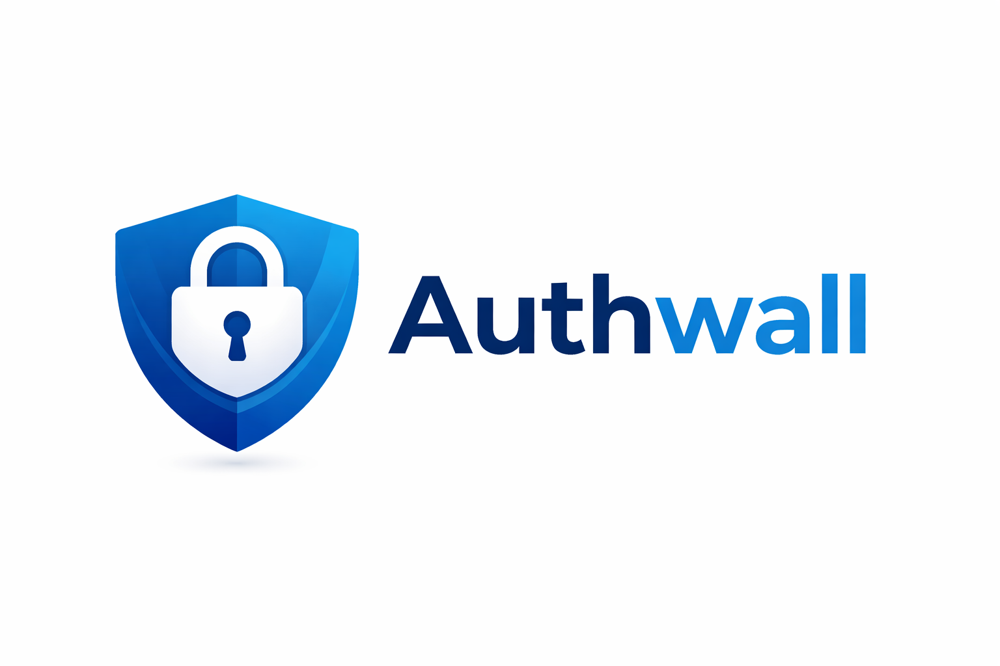
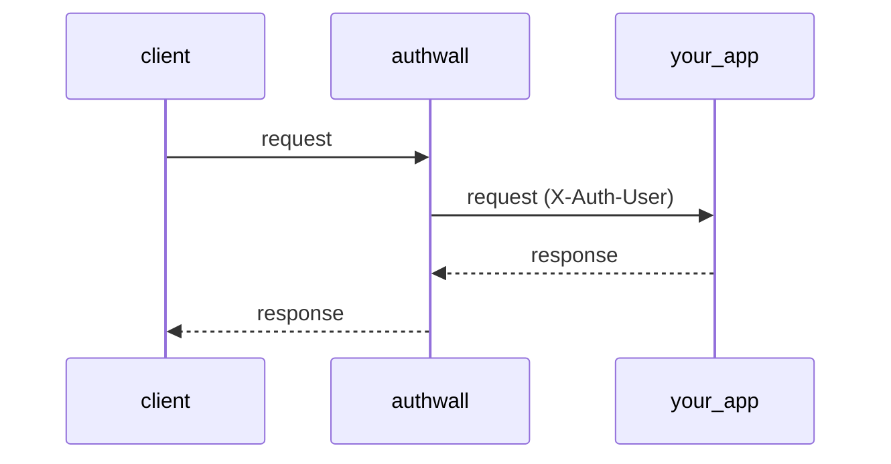

<p>
<a target="_blank" href="https://hub.docker.com/r/vbarbarosh/authwall"></a>
<a target="_blank" href="https://hub.docker.com/r/vbarbarosh/authwall"></a>
<a target="_blank" href="https://github.com/vbarbarosh/authwall"></a>
<a target="_blank" href="https://github.com/vbarbarosh/authwall"></a>
<br>
<a target="_blank" href="https://github.com/vbarbarosh/authwall/actions"></a>
<a target="_blank" href="https://github.com/vbarbarosh/authwall/actions"></a>
<a target="_blank" href="https://github.com/vbarbarosh/authwall/actions"></a>
<a target="_blank" href="https://opensource.org/licenses/MIT" rel="nofollow"></a>
<a target="_blank" href="https://codecov.io/gh/vbarbarosh/authwall"></a>
</p>

<p align="center"></p>

**Authwall** is an authentication proxy — it sits between clients and an internal app,
handling sign-in (email/password, magic links, Google OAuth, GitHub OAuth) and forwarding
authenticated requests with an `X-Auth-User` header.

```
client
    ↓
authwall
    ↓
your app
```



## Quick Start

```
Public → Sign up → Signed in → Proxied resource
```

Authwall runs with zero configuration. By default, it uses SQLite and enables open registration.

---

### Open registration (username + password only)

```bash
docker run --rm -p 3000:3000 \
    -e AUTHWALL_TARGET_URL=https://app.test \
    vbarbarosh/authwall
```

**Behavior:**

* sign-in: **username + password**
* registration: **open**
* email features: **disabled**
* storage: **SQLite (ephemeral unless volume mounted)**

---

### Open registration (username/email + password + magic link)

```bash
docker run --rm -p 3000:3000 \
    -e AUTHWALL_TARGET_URL=https://app.test \
    -e AUTHWALL_RESEND_KEY=re_xxx \
    -e AUTHWALL_RESEND_FROM="Authwall <noreply@app.test>" \
    vbarbarosh/authwall
```

**Behavior:**

* sign-in: **username/email + password**
* magic link: **enabled**
* email verification: **enabled**
* registration: **open**

## Notes

* If no mailer is configured, **email-based flows are disabled automatically**
* First user is created via sign-up (no bootstrap user required)
* Data is stored inside the container unless a volume is mounted

## Philosophy

* **Zero-config start**
* **Env-driven configuration**
* **Optional advanced config via settings.yaml**
* **Sensible defaults for local development**

## Secret Management

`AUTHWALL_SECRET` is optional.

Startup order is:

1. Use `AUTHWALL_SECRET` when it is set.
2. Otherwise, load `/app/data/secret.key` if it already exists.
3. Otherwise, generate a new random secret, write it to `/app/data/secret.key`, and use that value.

Why this default exists:

- Authwall derives session and CSRF secrets from one root secret, so that root value must stay stable across restarts.
- Requiring an env var for every local or single-host deployment makes first boot harder and encourages weak placeholder values.
- Persisting the generated secret in the data directory keeps restarts deterministic as long as the data volume is preserved.
- An explicit `AUTHWALL_SECRET` still takes precedence, which is the better fit when secrets are managed by the runtime or an external secret store.

If you rotate either `AUTHWALL_SECRET` or `data/secret.key`, existing sessions and CSRF tokens become invalid by design.
