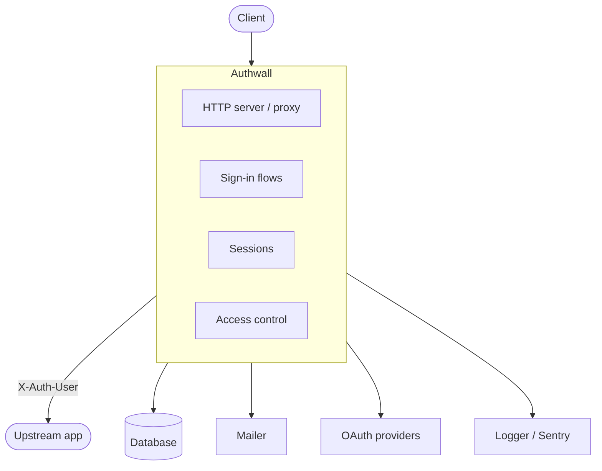

# Architecture

Authwall is an authentication proxy: it sits in front of an app, handles
sign-in, and forwards authenticated requests upstream. This page is a
high-level map of its big blocks — follow the links for detail.

## Request path

- **HTTP server / proxy** — accepts every request, serves Authwall's own
  `/auth` pages, and reverse-proxies everything else to the upstream app with an
  `X-Auth-User` header for signed-in users. See [Deployment](deployment.md).
- **Upstream app** — the protected application Authwall forwards to, set by
  [`AUTHWALL_TARGET_URL`](config.md#authwall_target_url).

## Authentication

- **Sign-in flows** — password, magic link/code, and OAuth. See
  [Sign-in flows](sign-in-flows.md).
- **OAuth providers** — Google, GitHub, Microsoft, Facebook, X, and Discord
  (external). See [OAuth providers](oauth-providers.md).
- **Sessions** — server-side session records plus a signed cookie keep users
  signed in. See [Security model](security.md).
- **Access control** — allow/deny rules over emails and domains decide who may
  sign in. See [Access rules](config.md#access-rules).

## Storage and outbound

- **Database** — users, identities, sessions, and auth events; SQLite by
  default, or MySQL / PostgreSQL. See [`AUTHWALL_DB`](config.md#authwall_db).
- **Mailer** — sends sign-in, confirmation, and notification email via Resend,
  Mailjet, or Amazon SES (external). See [Emails](emails.md).

## Observability

- **Logger** — request and event logging to a daily file or stdout. See
  [`AUTHWALL_LOGGER`](config.md#authwall_logger).
- **Sentry** — optional error reporting (external). See
  [Sentry](config.md#sentry).
