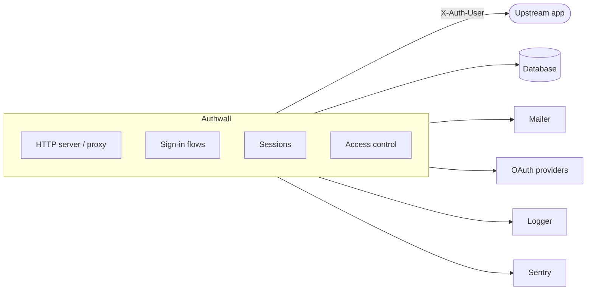

# Architecture

Authwall is an authentication proxy: it sits in front of an app, handles
sign-in, and forwards authenticated requests upstream. This page is a
high-level map of its big blocks — follow the links for detail.

The big blocks, with their options:

- [**HTTP server / proxy**](deployment.md)
- [**Sign-in flows**](sign-in-flows.md)
  - [password](sign-in-flows.md#password)
  - [magic link / code](sign-in-flows.md#magic-link-code)
  - [OAuth](oauth-providers.md)
    - [Google](oauth-providers.md#google)
    - [GitHub](oauth-providers.md#github)
    - [Microsoft](oauth-providers.md#microsoft)
    - [Facebook](oauth-providers.md#facebook)
    - [X](oauth-providers.md#x-formerly-twitter)
    - [Discord](oauth-providers.md#discord)
- [**Sessions**](security.md)
- [**Access control**](config.md#access-rules)
- [**Database**](config.md#authwall_db)
  - [SQLite](config.md#authwall_db)
  - [MySQL](config.md#authwall_db)
  - [PostgreSQL](config.md#authwall_db)
- [**Mailer**](config.md#authwall_mailer)
  - [Resend](config.md#resend)
  - [Mailjet](config.md#mailjet)
  - [Amazon SES](config.md#amazon-ses)
- [**Logger**](config.md#authwall_logger)
  - [daily file](config.md#authwall_logger)
  - [stdout](config.md#authwall_logger)
- [**Sentry**](config.md#sentry)

