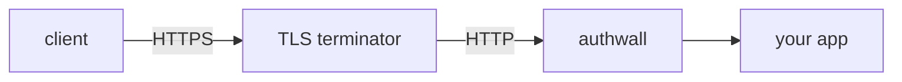

# Deployment

[Getting started](getting-started.md) gets Authwall running. This page covers
what to change when moving from a trial to a real deployment: HTTPS, a durable
secret, a production database, logging, and health checks.

For the exact syntax and defaults of every variable mentioned here, see the
[configuration reference](config.md).

## Runnable examples

[`examples/`](examples/) holds self-contained Docker Compose setups for the
common topologies — Authwall as the entrypoint, behind nginx or Caddy, or as a
sidecar auth checker. Each is runnable with `docker compose up` and is a good
starting point to copy from. See [`examples/README.md`](examples/README.md) for
a chooser.

## The Docker image

Authwall is published as `vbarbarosh/authwall` on Docker Hub. The image:

- runs as the non-root `node` user;
- uses `dumb-init` as PID 1 for correct signal handling;
- sets `NODE_ENV=production`, `LISTEN=0.0.0.0`, `PORT=3000`, and
  `AUTHWALL_LOGGER=stdout` by default;
- is tagged per release (`:1`, `:1.12`, `:1.12.0`) as well as `:latest`.

Pin a version tag in production so deployments are reproducible.

## HTTPS and the public URL

Authwall does not terminate TLS itself. In production it runs behind a TLS
terminator — a reverse proxy (nginx, Caddy) or a cloud load balancer — that
holds the certificate and forwards plain HTTP to Authwall:

```
client → TLS terminator (HTTPS) → authwall → your app
```



Set [`AUTHWALL_PUBLIC_URL`](config.md#authwall_public_url) to the externally
visible HTTPS URL. This value builds the links in emails and OAuth redirects,
and — importantly — it drives the default of
[`AUTHWALL_COOKIE_SECURE`](config.md#session-cookie): when `AUTHWALL_PUBLIC_URL`
begins with `https://`, the session cookie is marked `Secure` automatically.

```sh
AUTHWALL_PUBLIC_URL=https://auth.myapp.test
```

When OAuth providers are configured, their redirect URLs must use this same
public HTTPS origin — see [OAuth providers](oauth-providers.md).

## The session secret

Authwall derives its session secret from one root secret, so that value
must stay **stable across restarts**. Resolution order:

1. `AUTHWALL_SECRET` if it is set (must be at least 32 characters);
2. otherwise `/app/data/secret.key` if that file exists;
3. otherwise a new random secret is generated and written to that file.

For a single host, persisting `/app/data` (so `secret.key` survives restarts)
is enough. When secrets are managed by an orchestrator or an external secret
store — or when more than one Authwall instance must share sessions — set
`AUTHWALL_SECRET` explicitly and identically on every instance.

Generate one with [`bin/random-secret`](cli.md#secrets-and-hashing). Rotating
the secret invalidates all existing sessions and CSRF tokens by design.

## Database

Authwall supports SQLite (default), MySQL, and PostgreSQL, selected by
[`AUTHWALL_DB`](config.md#authwall_db).

- **SQLite** — the default when `AUTHWALL_DB` is unset. Fine for a single
  instance; the database file lives under the data directory, which must be on
  a persistent volume.
- **MySQL / PostgreSQL** — set `AUTHWALL_DB` to a `mysql://` or `postgres://`
  URI. Use this when you want managed backups, or when running more than one
  Authwall instance against shared state.

Pending migrations are applied automatically when Authwall starts — there is no
separate migration step to run for a deployed instance. On boot Authwall waits
for the database to accept connections before serving traffic.

## Cookies

The [session cookie](config.md#session-cookie) is normally fine with defaults,
but two cases need attention:

- **Subdomains** — if users reach Authwall and the app on different subdomains,
  set `AUTHWALL_COOKIE_DOMAIN` to the shared parent domain.
- **Cross-site** — `AUTHWALL_COOKIE_SAMESITE=none` requires
  `AUTHWALL_COOKIE_SECURE=true`; Authwall refuses to start otherwise.

The cookie lifetime is fixed at 30 days.

## Forwarding to the upstream

Requests that are not under `/auth` are proxied to
[`AUTHWALL_UPSTREAM_URL`](config.md#authwall_upstream_url) — Authwall's single
upstream. For authenticated, non-public requests Authwall adds an `X-Auth-User`
header so the upstream can identify the user.

[`AUTHWALL_UPSTREAM_MODE`](config.md#authwall_upstream_mode) decides how requests
are forwarded: `direct` when one app sits behind Authwall, or `proxy` when the
upstream is a reverse proxy that fans out to several domains. Use
[`AUTHWALL_SET_HEADERS` / `AUTHWALL_UNSET_HEADERS`](config.md#authwall_set_headers)
to add or strip headers on proxied requests.

## Logging

The Docker image defaults to [`AUTHWALL_LOGGER=stdout`](config.md#authwall_logger),
which is correct for containers — a log collector or `docker logs` picks it up.
Use `daily` only when writing to a persistent log directory on disk.

## Error reporting

Set [`AUTHWALL_SENTRY_DSN`](config.md#sentry) to send exceptions to Sentry.
Authwall strips cookies, authorization headers, and request bodies, and redacts
OAuth `code` / `state` / `token` parameters before events are sent.

## Health checks

`GET /auth/health` is unauthenticated, returns `OK` with HTTP `200`, and sets an
`x-authwall-version` response header. Point container, orchestrator, or load
balancer liveness/readiness probes at it.

```
GET /auth/health  →  200 OK
```

## Restricting access

By default registration is open — anyone can sign up. To run Authwall as a
gate for a known set of users, configure the
[access rules](config.md#access-rules) (`AUTHWALL_ALLOWED_EMAILS`,
`AUTHWALL_ALLOWED_DOMAINS`, and the deny lists). They apply to every sign-in
flow, including OAuth.

Per-IP [rate limiting](config.md#authwall_rate_limiting) is on by default;
leave it on unless an upstream proxy already throttles requests.

## Production checklist

- [ ] Pin a versioned image tag (e.g. `vbarbarosh/authwall:1.12.0`).
- [ ] Terminate TLS in front of Authwall.
- [ ] Set `AUTHWALL_PUBLIC_URL` to the HTTPS URL.
- [ ] Persist the data directory, or set `AUTHWALL_SECRET` explicitly.
- [ ] Use MySQL or PostgreSQL if you need backups or multiple instances.
- [ ] Confirm `AUTHWALL_COOKIE_SECURE` is `true` (automatic under HTTPS).
- [ ] Configure a real mailer if any email-based flow is enabled.
- [ ] Restrict registration with the access rules if sign-up should not be open.
- [ ] Wire `/auth/health` into your liveness/readiness probes.
- [ ] Set `AUTHWALL_SENTRY_DSN` if you want error reporting.
