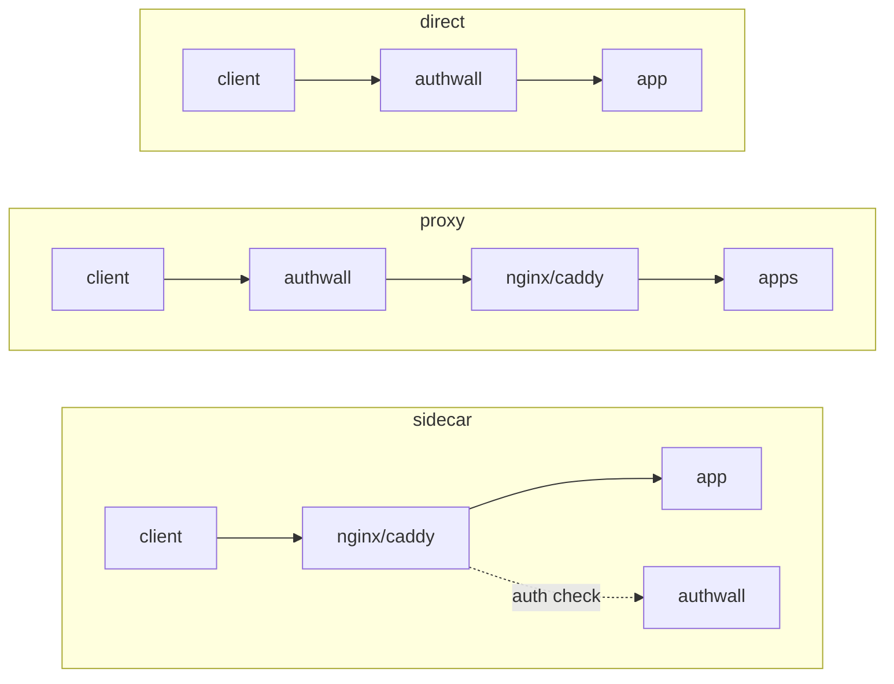

# Deployment examples

Each subdirectory is a self-contained, runnable deployment. Pick the one that
matches how you want Authwall to sit relative to your app, then:

```sh
cd docs/examples/<scenario>
docker compose up
```

All examples use SQLite (no database service) and `jmalloc/echo-server` as a
stand-in upstream app, so the `X-Auth-User` header is visible in the echoed
response. Environment variables are inline in each `docker-compose.yaml` — there
is no `.env` file to create.

## The three topologies

In every topology Authwall is the entrypoint and has exactly one upstream. The
topology is about what that upstream is.

| Scenario    | Authwall's upstream                                                       | Use when                                |
|-------------|---------------------------------------------------------------------------|-----------------------------------------|
| **direct**  | The app itself                                                            | One app sits behind Authwall            |
| **proxy**   | A reverse proxy that routes by domain                                     | Several domains sit behind one Authwall |
| **sidecar** | — (the reverse proxy serves the app; Authwall only answers an auth check) | You want Authwall out of the data path  |

```
direct    client → authwall → app
proxy     client → authwall → nginx/caddy → apps
sidecar   client → nginx/caddy → app
                         ↑ auth check
                      authwall
```



## Examples

- [`authwall-direct/`](authwall-direct/) — one app behind Authwall.
- [`authwall-proxy-nginx/`](authwall-proxy-nginx/) — several domains, nginx fan-out.
- [`authwall-proxy-caddy/`](authwall-proxy-caddy/) — several domains, Caddy fan-out.
- [`authwall-sidecar-nginx/`](authwall-sidecar-nginx/) — nginx `auth_request`.
- [`authwall-sidecar-caddy/`](authwall-sidecar-caddy/) — Caddy `forward_auth`.

These examples run over plain HTTP for simplicity. For real deployments see
[../deployment.md](../deployment.md).

## Resetting

Each example persists Authwall's data (the SQLite database and the generated
secret) in a `./data` directory. To start fresh:

```sh
docker compose down
rm -rf data
```
