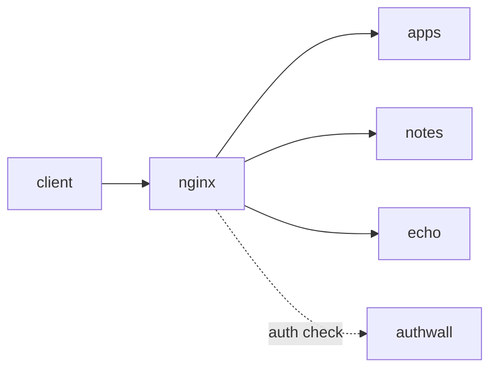

# authwall-sidecar-nginx

Several domains behind nginx, with Authwall as a sidecar auth checker. nginx
serves each domain's app directly and consults Authwall only for an auth
decision, using nginx's `auth_request` module. Authwall is **not** in the data
path.

```
client → nginx → { apps, notes, echo }
            ↑ auth check
         authwall
```



Use this topology when you want Authwall out of the request path — for
performance or isolation — and only need it to answer "is this user signed
in?" on each request.

## Set up local hostnames

The example uses three domains, so add them to your hosts file — `/etc/hosts`
on Linux/macOS, `C:\Windows\System32\drivers\etc\hosts` on Windows:

```
127.0.0.1 apps.mydomain.test
127.0.0.1 notes.mydomain.test
127.0.0.1 echo.mydomain.test
```

## Run it

```sh
docker compose up
```

Then open any of the three domains on port 3000:

- <http://apps.mydomain.test:3000>
- <http://notes.mydomain.test:3000>
- <http://echo.mydomain.test:3000>

You are redirected to Authwall's sign-in page, served under `/auth` on the same
domain; sign up, and you are sent back to the app you started from. Because the
session cookie is scoped to `mydomain.test` (`AUTHWALL_COOKIE_DOMAIN`), that one
sign-in is valid across all three domains. Each `echo-server` response shows the
`X-Auth-User` header nginx attached from Authwall's auth decision.

## How it works

`nginx.conf` is the whole nginx config, mounted over `/etc/nginx/nginx.conf`.
A single `*.mydomain.test` server serves two things:

- **`/auth/…`** is proxied to Authwall — its sign-in UI, OAuth callbacks, and
  the `/auth/sidecar` endpoint.
- **everything else** is the protected app. For each request nginx makes an
  internal `auth_request` to `/auth/sidecar`; on **200** it copies `X-Auth-User`
  and proxies to the app picked from the request `Host` by a `map`; on **401**
  it redirects the browser to the sign-in page with a `return` URL so the user
  comes back.

`AUTHWALL_COOKIE_DOMAIN=mydomain.test` scopes the session cookie to every
`*.mydomain.test` domain, so one sign-in covers all of them.

## Security notes

- `X-Auth-User` is set by nginx from the auth subrequest's response, which
  overrides any value a client tried to send. The app can trust it.
- The apps are reachable only through nginx — do not publish the `apps` /
  `notes` / `echo` services directly, or requests would bypass the auth check.

## What to change for your app

- Replace the `apps` / `notes` / `echo` services with your own apps.
- Edit the `map $host $upstream` entries in `nginx.conf` to match your domains.
- The `/auth/` path prefix is reserved for Authwall on every domain — if an app
  has its own routes under `/auth/`, route them more specifically.
- For HTTPS, terminate TLS in front of nginx and set `AUTHWALL_PUBLIC_URL`
  accordingly.
