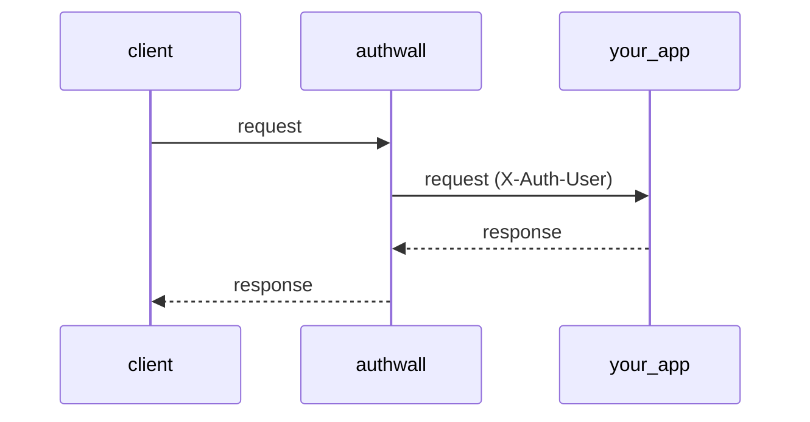

# Overview

**Authwall** is an authentication proxy — it sits between clients and an internal app,
handling sign-in (email/password, magic links, and OAuth) and forwarding
authenticated requests with an `X-Auth-User` header.

```
client → authwall → your app
```



## Quick start

Authwall runs with zero configuration: by default it uses SQLite and open
registration. Each recipe below is a complete `docker run` command — pick the
one that matches how you want users to sign in. More setups — seeded users,
personal access tokens, WebSockets — are in [Recipes](recipes.md).

---

### Open registration (username + password only)

```bash
docker run --rm -p 3000:3000 \
    -e AUTHWALL_UPSTREAM_URL=http://internal:8080 \
    vbarbarosh/authwall
```

**Behavior:**

* sign-in: **username + password**
* registration: **open**
* email features: **disabled**
* storage: **SQLite (ephemeral unless volume mounted)**

---

### Open registration (username/email + password + magic link)

```bash
docker run --rm -p 3000:3000 \
    -e AUTHWALL_UPSTREAM_URL=http://internal:8080 \
    -e AUTHWALL_RESEND_KEY=re_xxx \
    -e AUTHWALL_RESEND_FROM="Authwall <noreply@myapp.test>" \
    vbarbarosh/authwall
```

**Behavior:**

* sign-in: **username/email + password**
* magic link: **enabled**
* email confirmation: **enabled**
* registration: **open**

---

### Google OAuth only

Create a Google OAuth client and add this authorized redirect URI:

```
https://myapp.test/auth/google/callback
```

Then run:

```bash
docker run --rm -p 3000:3000 \
    -e AUTHWALL_PUBLIC_URL=https://myapp.test \
    -e AUTHWALL_UPSTREAM_URL=http://internal:8080 \
    -e AUTHWALL_GOOGLE_CLIENT_ID=xxx.apps.googleusercontent.com \
    -e AUTHWALL_GOOGLE_CLIENT_SECRET=GOCSPX_xxx \
    -e AUTHWALL_GOOGLE_REDIRECT_URL=https://myapp.test/auth/google/callback \
    vbarbarosh/authwall
```

**Behavior:**

* sign-in: **Google OAuth**
* registration: **open for Google accounts**
* email identity: **added only when Google reports a verified email**
* email features: **disabled unless a mailer is configured**

---

### Google OAuth with an email allowlist

Same Google OAuth client as above, plus `AUTHWALL_ALLOWED_EMAILS` to limit
sign-in to named addresses:

```bash
docker run --rm -p 3000:3000 \
    -e AUTHWALL_PUBLIC_URL=https://myapp.test \
    -e AUTHWALL_UPSTREAM_URL=http://internal:8080 \
    -e AUTHWALL_GOOGLE_CLIENT_ID=xxx.apps.googleusercontent.com \
    -e AUTHWALL_GOOGLE_CLIENT_SECRET=GOCSPX_xxx \
    -e AUTHWALL_GOOGLE_REDIRECT_URL=https://myapp.test/auth/google/callback \
    -e AUTHWALL_ALLOWED_EMAILS=alice@example.com,bob@example.com \
    vbarbarosh/authwall
```

**Behavior:**

* sign-in: **Google OAuth**
* registration: **open for listed Google accounts**
* allowed users: **only verified Google emails listed in `AUTHWALL_ALLOWED_EMAILS`**
* everyone else: **rejected**

## Notes

* If no mailer is configured, **email-based flows are disabled automatically**
* First user is created via sign-up (no bootstrap user required)
* Data is stored inside the container unless a volume is mounted

## Philosophy

* **Zero-config start** — `docker run` works with no required variables.
* **Env-driven configuration** — everything is set through `AUTHWALL_*`
  environment variables; see the [configuration reference](config.md).
* **Fail loudly** — anything you request explicitly (a mailer, a flow, a
  provider) must be fully configured, or Authwall refuses to start instead of
  silently falling back.
* **Sensible defaults for local development** — SQLite, open registration, no
  mailer required; rarely-needed knobs live in `config/settings.yaml`.

## Secret management

`AUTHWALL_SECRET` is optional.

Startup order is:

1. Use `AUTHWALL_SECRET` when it is set.
2. Otherwise, load `/app/data/secret.key` if it already exists.
3. Otherwise, generate a new random secret, write it to `/app/data/secret.key`, and use that value.

Why this default exists:

- Authwall derives its session secret from one root secret, so that root value must stay stable across restarts.
- Requiring an env var for every local or single-host deployment makes first boot harder and encourages weak placeholder values.
- Persisting the generated secret in the data directory keeps restarts deterministic as long as the data volume is preserved.
- An explicit `AUTHWALL_SECRET` still takes precedence, which is the better fit when secrets are managed by the runtime or an external secret store.

If you rotate either `AUTHWALL_SECRET` or `data/secret.key`, existing sessions and CSRF tokens become invalid by design.

## Related projects

- [Auth0 – hosted identity platform](https://auth0.com/)
- [WorkOS – enterprise SSO and user management](https://workos.com/)
- [Supabase Auth – open-source auth with many integrations](https://supabase.com/auth)
- [Netlify GoTrue – JWT-based API for managing users and issuing tokens](https://github.com/netlify/gotrue)
- [Firebase Auth – simple, multi-platform sign-in](https://firebase.google.com/products/auth)
- [Amazon Cognito – AWS authentication and access control](https://aws.amazon.com/cognito/)
- [Authentik – open-source identity provider](https://goauthentik.io/)
- [Keycloak – open-source identity and access management](https://www.keycloak.org/)
- [Authelia – open-source authentication portal with MFA and SSO](https://www.authelia.com/)
- [Zitadel – open-source identity infrastructure](https://zitadel.com/)
- [Ory – composable open-source IAM](https://www.ory.com/)
- [Tinyauth – tiny OIDC server for self-hosted applications](https://tinyauth.app/)
- [Logto – modern auth infrastructure for developers](https://logto.io/)
- [Clerk – authentication and complete user management](https://clerk.com/)
- [OAuth2 Proxy – reverse proxy that authenticates via OAuth providers](https://oauth2-proxy.github.io/oauth2-proxy/)
- [Kanidm – simple, secure identity management platform](https://kanidm.com/)
- [lldap – light LDAP implementation](https://github.com/lldap/lldap)
- [Rauthy – OIDC single sign-on and IAM](https://sebadob.github.io/rauthy/)
- [Casdoor – authentication and authorization platform](https://www.casdoor.com/)
- [PocketBase – open-source backend in one file](https://pocketbase.io/)
