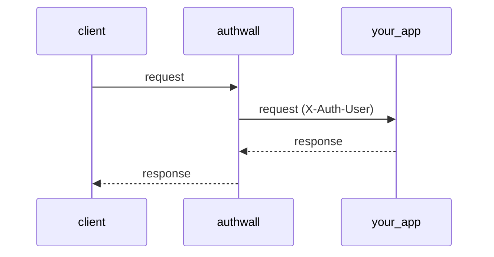

# Overview

**Authwall** is an authentication proxy — it sits between clients and an internal app,
handling sign-in (email/password, magic links, Google OAuth, GitHub OAuth) and forwarding
authenticated requests with an `X-Auth-User` header.

```
client
    ↓
authwall
    ↓
your app
```



## Quick Start

```
Public → Sign up → Signed in → Proxied resource
```

Authwall runs with zero configuration. By default, it uses SQLite and enables open registration.

---

### Open registration (username + password only)

```bash
docker run --rm -p 3000:3000 \
    -e AUTHWALL_TARGET_URL=http://internal:8080 \
    vbarbarosh/authwall
```

**Behavior:**

* sign-in: **username + password**
* registration: **open**
* email features: **disabled**
* storage: **SQLite (ephemeral unless volume mounted)**

---

### Open registration (username/email + password + magic link)

```bash
docker run --rm -p 3000:3000 \
    -e AUTHWALL_TARGET_URL=http://internal:8080 \
    -e AUTHWALL_RESEND_KEY=re_xxx \
    -e AUTHWALL_RESEND_FROM="Authwall <noreply@myapp.test>" \
    vbarbarosh/authwall
```

**Behavior:**

* sign-in: **username/email + password**
* magic link: **enabled**
* email confirmation: **enabled**
* registration: **open**

---

### Google OAuth only

Create a Google OAuth client and add this authorized redirect URI:

```
https://myapp.test/auth/google/callback
```

Then run:

```bash
docker run --rm -p 3000:3000 \
    -e AUTHWALL_PUBLIC_URL=https://myapp.test \
    -e AUTHWALL_TARGET_URL=http://internal:8080 \
    -e AUTHWALL_GOOGLE_CLIENT_ID=xxx.apps.googleusercontent.com \
    -e AUTHWALL_GOOGLE_CLIENT_SECRET=GOCSPX_xxx \
    -e AUTHWALL_GOOGLE_REDIRECT_URL=https://myapp.test/auth/google/callback \
    vbarbarosh/authwall
```

**Behavior:**

* sign-in: **Google OAuth**
* registration: **open for Google accounts**
* email identity: **added only when Google reports a verified email**
* email features: **disabled unless a mailer is configured**

---

### Google OAuth with exact user emails

Create a Google OAuth client and add this authorized redirect URI:

```
https://myapp.test/auth/google/callback
```

Then run:

```bash
docker run --rm -p 3000:3000 \
    -e AUTHWALL_PUBLIC_URL=https://myapp.test \
    -e AUTHWALL_TARGET_URL=http://internal:8080 \
    -e AUTHWALL_GOOGLE_CLIENT_ID=xxx.apps.googleusercontent.com \
    -e AUTHWALL_GOOGLE_CLIENT_SECRET=GOCSPX_xxx \
    -e AUTHWALL_GOOGLE_REDIRECT_URL=https://myapp.test/auth/google/callback \
    -e AUTHWALL_ALLOWED_EMAILS=alice@example.com,bob@example.com \
    vbarbarosh/authwall
```

**Behavior:**

* sign-in: **Google OAuth**
* registration: **open for listed Google accounts**
* allowed users: **only verified Google emails listed in `AUTHWALL_ALLOWED_EMAILS`**
* everyone else: **rejected**

## Notes

* If no mailer is configured, **email-based flows are disabled automatically**
* First user is created via sign-up (no bootstrap user required)
* Data is stored inside the container unless a volume is mounted

## Philosophy

* **Zero-config start**
* **Env-driven configuration**
* **Optional advanced config via settings.yaml**
* **Sensible defaults for local development**

## Secret Management

`AUTHWALL_SECRET` is optional.

Startup order is:

1. Use `AUTHWALL_SECRET` when it is set.
2. Otherwise, load `/app/data/secret.key` if it already exists.
3. Otherwise, generate a new random secret, write it to `/app/data/secret.key`, and use that value.

Why this default exists:

- Authwall derives session and CSRF secrets from one root secret, so that root value must stay stable across restarts.
- Requiring an env var for every local or single-host deployment makes first boot harder and encourages weak placeholder values.
- Persisting the generated secret in the data directory keeps restarts deterministic as long as the data volume is preserved.
- An explicit `AUTHWALL_SECRET` still takes precedence, which is the better fit when secrets are managed by the runtime or an external secret store.

If you rotate either `AUTHWALL_SECRET` or `data/secret.key`, existing sessions and CSRF tokens become invalid by design.

## Related projects

- [Auth0 – Auth0 provides a secure, reliable, and scalable identity foundation, so you can focus on building what's next](https://auth0.com/)
- [WorkOS – Enterprise SSO (and a whole lot more)](https://workos.com/)
- [Supabase Auth – Open Source Auth (with tons of integrations)](https://supabase.com/auth)
- [Netlify GoTrue – An JWT based API for managing users and issuing JWT tokens](https://github.com/netlify/gotrue)
- [Firebase Auth – Simple, multi-platform sign-in](https://firebase.google.com/products/auth)
- [Amazon Cognito – Implement secure, scalable authentication and access control for users, AI agents, and microservices in minutes](https://aws.amazon.com/cognito/)
- [Authentik – Take control of your identity needs with a secure, flexible solution](https://goauthentik.io/)
- [Keycloak – Open Source Identity and Access Management](https://www.keycloak.org/)
- [Authelia – Authelia is an open-source authentication and authorization server and portal fulfilling the identity and access management (IAM) role of information security in providing multi-factor authentication and single sign-on (SSO) for your applications via a web portal](https://www.authelia.com/)
- [Zitadel – Identity infrastructure, simplified for you](https://zitadel.com/)
- [Ory – Composable, scalable, transparent IAM for agents, customers, and B2B](https://www.ory.com/)
- [Tinyauth – Tinyauth is a tiny OpenID Connect (OIDC) authentication and authorization server for your self-hosted applications](https://tinyauth.app/)
- [Logto – Modern auth infrastructure for developers](https://logto.io/)
- [Clerk – More than authentication, Complete User Management](https://clerk.com/)
- [OAuth2 Proxy – A reverse proxy and static file server that provides authentication using Providers (Google, GitHub, and others) to validate accounts by email, domain or group](https://oauth2-proxy.github.io/oauth2-proxy/)
- [Kanidm – A simple, secure, and fast identity management platform](https://kanidm.com/)
- [lldap – Light LDAP implementation](https://github.com/lldap/lldap)
- [Rauthy – OpenID Connect Single Sign-On Identity & Access Management](https://sebadob.github.io/rauthy/)
- [Casdoor – Authentication & Authorization for Every App](https://www.casdoor.com/)
- [PocketBase – Open Source backend in 1 file](https://pocketbase.io/)
